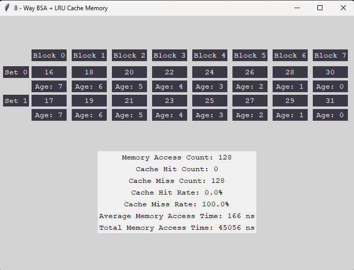
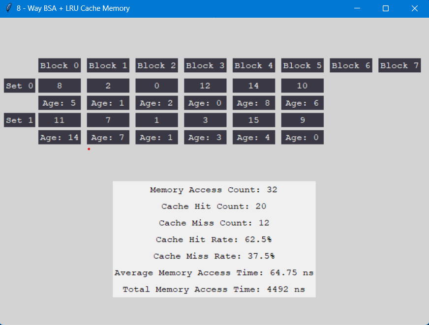
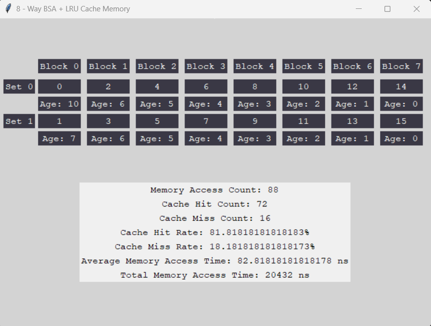

# CSARCH2 Cache Simulation
## Cache System Specifications:
- Type: 8-Way Block Set Associative + Load Through
- Number of cache blocks = 16 blocks
- Cache line = 32 words
- Read policy: load-through
- Number of memory blocks = user input

## How the program works
1. Input Number of Memory Blocks
2. Choose test case sequence option - (Sequential, Random, Mid-Way Repeat)
3. Choose between showing either step-by-step simulation or the final cache snapshot
3. At the end, the output will be displayed

## Detailed Test Case Analysis
Let the user input n be the number of memory blocks to be mapped to cache.

### Sequential sequence
Let us run through the sequence where:

    n = 16  
    number of sequence = 2(16) * 4 = 128 sequences

In a sequential sequence, we assume that the reading of the main memory sequence is done in a consecutive block order and it will be repeated 4 times. For this test case, the maximum number of memory blocks that can be mapped is 32 (2*16, according to specifications). The set where the accessed block will be placed is determined by the block address modulo set count. This is seen in the simulation, where even blocks are placed in Set 0 and odd blocks are placed in Set 1. From the output, there is no cache hit that was recorded due to the structure of the sequence. Since the number of cache blocks is less than the number of sequences read and the replacement algorithm used is LRU - Least Recently Used, when the sequence is repeated there is no chance of cache hit since it is overridden by other blocks. However, if the number of cache blocks is greater than the number of memory blocks being read, there will be a chance of cache hit upon repetition. 

### Random Sequence
In a random sequence, the memory blocks are accessed in a non-sequential order. For this case, the total number of memory blocks to be mapped is 4n. This means that if the user input is n, the total number of blocks is 4n, and the range of the memory block addresses is from 0-(4n-1). In cases where there is a cache hit, the set where the block belongs would be identified and every block of that set would be checked. Since the block address already exists in the cache, the age of the cache block containing the address would be reset to zero, and all the other cache block ages are updated accordingly. In cache misses, the corresponding set is checked to see if there is still available space. If there is none, according to the LRU replacement policy, the block address is stored in the cache block with the highest age. 

With that being said, for the output in random sequence:

 	n = 16
	number of memory blocks to be mapped = 4n = 64 

Note: It is possible for the randomized sequence in the program to have repeating block addresses.
 
OUTPUT: 

### Mid-repeat Blocks
For mid-repeat blocks, the memory locations are accessed in a specific pattern. In cases where there is a cache miss, every set is checked, and if the block address is not found, LRU policy is applied, with the block with the highest age being replaced. For cache hits, the cache block corresponding to the accessed memory block is identified and then updated (the age is set to zero and all other cache blocks in the same set are updated accordingly).  With the application of 8-way BSA and LRU, all frequently accessed blocks would remain in the cache.

How mid-repeat blocks work:

	Let n = 8
 	since n = 8, the sequence would be as follows:
  	1. 0 to (n - 1): this means that 0,1,2,3,4,5,6 would be placed
   	2. 1 - (2n-1)
    	3. Steps 1 and 2 are repeated 4 times.

From the example above the sequence would look like this 

 	0 1 2 3 4 5 6 1 2 3 4 5 6 7 8 9 10 11 12 13 14 15 (x4)

The output for this test case, with n = 8 should look like this:

