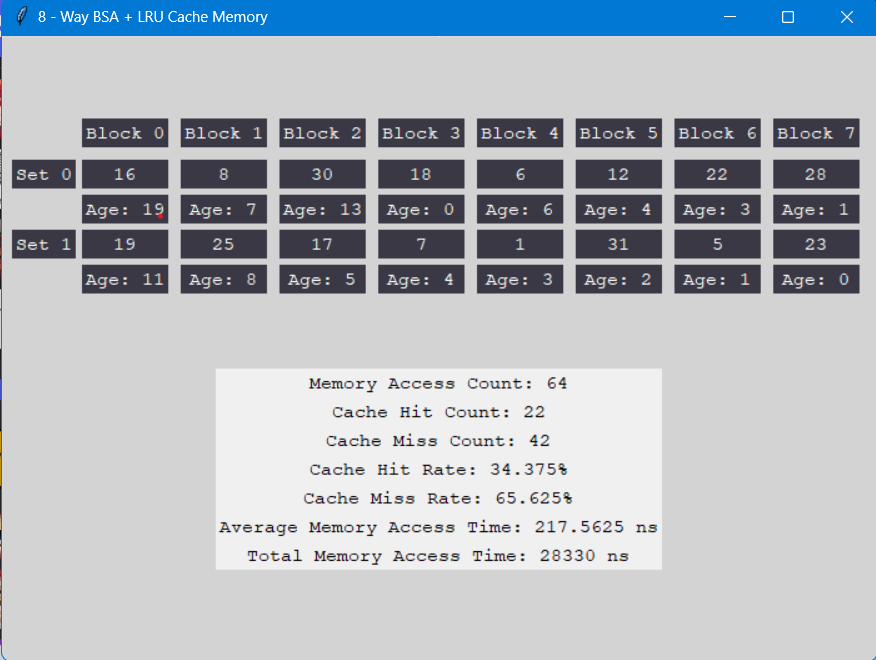

# CSARCH2 Cache Simulation
## Cache System Specifications:
- Type: 8-Way Block Set Associative + Load Through
- Number of cache blocks = 16 blocks
- Cache line = 32 words
- Read policy: load-through
- Number of memory blocks = user input

## How the program works?
1. Input Number of Memory Blocks
2. Choose option for sequence of memory block - (Sequential, Random, Mid-Way Repeat)
3. Choose between by steps-by-step simulation or final snapshot
3. At the end, output will be displayed and final cache memory allocated

## Detailed Test Case Analysis
Let us assume n = # of cache block = 16

### Sequential sequence
Let us run through the sequence where:
    n = 16
    number of sequence = 2(16) * 4 = 128 sequences

In a sequential sequence, we assume that reading of main memory sequence is in a consecutive block order and it will be repeated 4 times. The block that is being access will first be modulo by number of sets (2), this will determine in what set it will be placed and since BSA also has the characteristic of FA, it can be placed in any block. From the output, there is no cache hit that was recorded this due to the structure of the sequence and notice how even blocks are placed in Set 0 and odd blocks are placed in Set 1. Since number of cache blocks is less than number of sequences read and the replacement algorithm used is LRU - Least Recently Used, upon repetition of the sequence there is no chance of cache hit since it is overidden by other blocks. However, if the number of cache block is greater than number of sequence being read, there will be a chance of cache hit upon repetition. Overall, using a repeating sequential sequence in a 8-Way BSA with 16 cache blocks is a heavy toll for the cache system as there is a low chance of getting a cache hit.

### Random Sequence
On the other hand in random sequence, the memory locations are accessed in a non-sequential order. For this case the number of blocks is 4n. This means that on a user input n the range of the memory locations are from 0-4n while the the total nnumber of blocks is only 4n. In cases where there is a cache hit, the set where it belongs would be identified and every block of that set would be checked and it would replace the current block while updating the block's age since it is an LRU replacement policy whereas in a cache miss, every set would be checked if there is still an available space. If there is no available space the LRU policy comes in to play in order to replace the least used block. Overall 8-way associativity + LRU policy is efficient since in cache hits it would look for the set and replace it while in cache miss it will look for available spaces or replace the least used. This behavior ensures that the most used memory locations remain in the set.

with that being said the sequence would look like this where:
	
 	n = 16
	number of sequence = 4n = 64 
OUTPUT: 

### Mid-repeat Blocks
Lastly in mid-repeat blocks, the memory locations are accessed in a specific pattern. In cases where there is a cache hit, every set is checked and if the memory location is found it would be replaced and the LRU policy is applied. On the other hand in the case of cache miss, the set corresponding to the  memory's block address would be identidfied. Afterwards the set is checked for slot availability. If there is no slot available it would replace the least recently used block for that current set. With the application of an 8-way system and LRU all frequently accessed blocks would remain in the cache.

Mid-repeat blocks works in this way where:

	n =8
 	since n = 8 then the sequence would be as follows
  	1. (n - 1) this means that 0,1,2,3,4,5,6 would be placed
   	2. after this it would continue starting from 1 until it reaches 2n.
    	3. step 2 would repeat 4 times.

From the example above the sequence would look like this 

 	0 1 2 3 4 5 6
  	1 2 3 4 5 6 7 8 9 10 11 12 13 14 15 (x4)

With that being said the output should look like this

which continue up to 2n. Then, repeat the sequence four times. Example: if n=8, sequence=0, 1,2,3,4,5,6,
1,2,3,4,5,6, 7,8,9,10,11,12,13,14,15 {4x}
